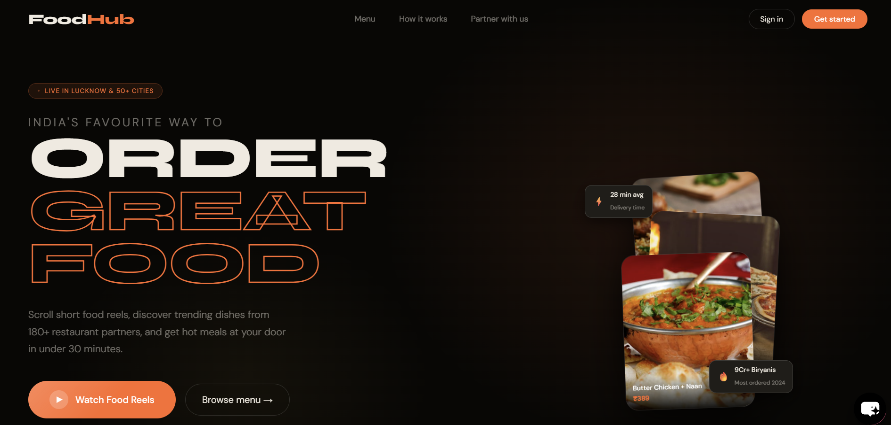
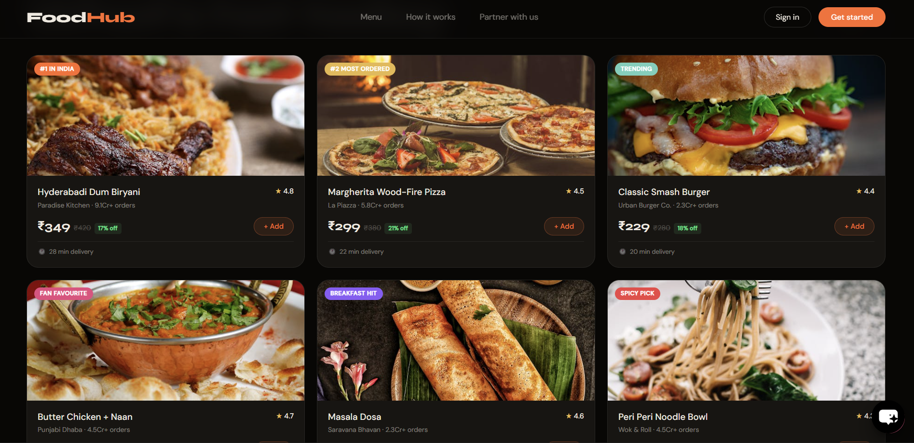
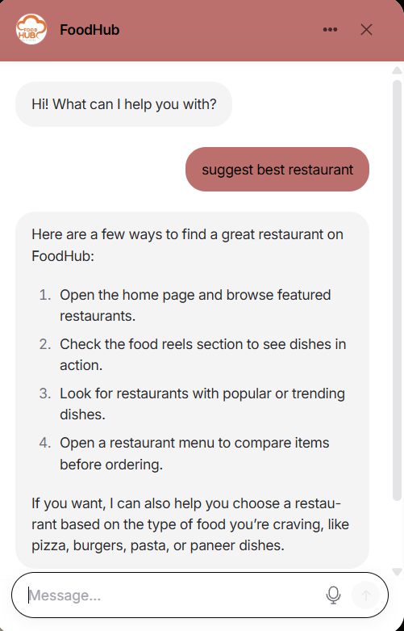

# FoodHub – AI Chatbot-Based Food Ordering Website

## Description
FoodHub is a full-stack online food ordering platform that allows users to browse restaurants, and order food seamlessly. 
It includes an AI chatbot for assistance and a short video (reel) feature for interactive food discovery.

## Features
- User authentication (Login/Signup)
- Restaurant listing and menu browsing
- Add to cart functionality
- AI chatbot for user assistance
- “Partner with Us” module for restaurant registration
- Short video/reel feature for browsing food items

## Tech Stack
- Frontend: HTML, CSS, JavaScript, React.js
- Backend: Node.js, Express.js
- Database: MongoDB

## How to Run
1. Clone the repository  
2. Install dependencies using `npm install`  
3. Start the server using `npm start`  
4. Open in browser at `localhost:3000`

## Screenshots
 ### Home Page 
 

 ### Restaurant Page 
 

 ### Chatbot Feature  
 
